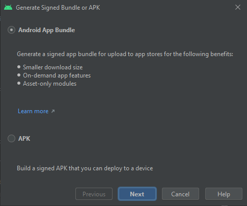

# Galaxy Force


## Gradle Properties

***

### Configuring Gradle Properties

The gradle build file (`app/build.gradle`) requires a number of secret properties to allow the application to successfully build.

These secrets should be kept separate from the application and never saved to source control. This is achieved by storing these properties in the user's home directory under: `/.gradle/gradle.properties`.

The properties below are used to provide the application's public key. The key is reversed and then split over the 4 separate public key properties.
```
PUBLIC_KEY1
PUBLIC_KEY2
PUBLIC_KEY3
PUBLIC_KEY4
```

The properties below allow the user to build a signed APK using the application's keystore:
```
KEYSTORE_FILE
KEYSTORE_PASSWORD
KEY_ALIAS
KEY_PASSWORD
```

Once the correct values are provided for each property in the above `/.gradle/gradle.properties` file, the application can be built successfully.

***


## Deploying to the Android Play Console

It is recommended that you deploy signed bundles to the Google Play Console.

***

### Building a Signed Bundle

From Android Studio, create a new signed App Bundle.

```
Build -> Clean Project
```

```
Build -> Generate Signed Bundle / APK...
```



Choose "Andrioid App Bundle" then click `Next`.


Enter details key store details. It is important that the same keystore is used every time to avoid bundles being rejected by the Google Play Console.

**NOTE:** When creating a bundle for the first time, export the encrypted key for [Google Play App Signing](https://developer.android.com/studio/publish/app-signing).
This will generate a `*.pepk` file. Keep this file safe. This file should also be uploaded to the Google Play Console in the `Release management > App integrity` menu.
This key is used by Google Play to sign your app for distribution to users.
 
- Click `Next`.
- Choose `release` build variant.
- Click `Finish`.

By default, your bundle will be located at: `...\galaxyforce\app\release\app-release.aab`

***

### Signed APKs

It is not recommended to upload Signed APK to Google Play Console any more.

However, this section on [Building, Testing and Deploying APKs](https://github.com/DannyNicholas/galaxyforce/raw/dev/assets/APKs.md) explains how to build and deploy signed APKs if needed.

***

### Deploy to Google Play Console

Click on `Testing -> Closed Testing`. Choose to `Manage Track` for `Beta`.


Click on `Create new release`.


Here you can:

- Upload your signed Bundle (`.../app/release/app-release.aab`)
- Enter a release name
- Add release notes

Then press `Save`.

Click `Review release` to see the release changes.
Once done, click `Start Rollout to Beta`.

**NOTE:** There is no need to upload deobfuscation mapping files with bundles. The deobfuscation file from the bundle is used.

***

## Creating Alien Characters

[Pixel Mash](https://nevercenter.com/pixelmash/) has been used to create alien characters used within this game.

### Sprite Generator

Some alien animations have been created using Tomatic Labs Random Game Sprite Generator. The generator creates multiple sprites arranged horizontally within a single image.

The generator normally surrounds sprites in black pixels. Use Pixel Mash to re-map the pixels from black (0, 0, 0) to dark-gray (64, 64, 64). Export the image.

The exported image can be extracted and scaled into separate sprites using the [Film Strip Image Extractor](https://github.com/DannyNicholas/film-strip-image-extractor).

### Hit Sprites

Each alien sprite should have an equivalent hit sprite, to be displayed when an alien is hit by a missile but not destroyed.

To create a hit sprite follow the steps below:

- Fill in any internal gaps with dark-gray (64, 64, 64).
- Re-map any white sprites (255, 255, 255) to light-gray (225, 225, 225).
- Colourise the sprite with red (255, 0, 0) or gray (200, 200, 200).
- Outline in light-yellow (225, 225, 43).
- Outline in white (255, 255, 255).

Export each individual sprite image.

***

## Alien Configuration

Each alien is given it's own behaviour using alien configuration.
This section explains the alien configuration options available.

All aliens extend the `BasicAlienConfig` that provide the following configuration.

- `AlienType` : determines alien behaviour (e.g. `HUNTER`).
- `AlienCharacter` :  alien graphics and animation
- `energy` : how many hits before the alien is destroyed
- `SpawnConfig` (optional) :  alien's ability to spawn other aliens
- `MissileConfig` (optional) : alien's missile firing behaviour
- `SpinningConfig` (optional) : describes alien's spinning animation
- `ExplosionConfig` (optional) : how alien explodes when destroyed

If the above optional configurations are not provided, the alien uses the default behaviour.
This is normally "none" with the exception of explosions, which use a default alien explosion.

### Alien Types

The following configurations are used to create the different alien types.

- `PathConfig` : Alien that follows a pre-determined path. Alien can also be angled to the path direction.
- `HunterConfig` : Alien that hunts the base. Alien can also be restricted to only move within set boundaries.
- `FollowableHunterConfig` : Alien that hunts the base (as above) and supports alien followers.
- `FollowerConfig` : Alien that follows of a followable alien (see above).
- `DirectionalResettableConfig` : Alien that travels in a specific direction. Once off-screen, alien is reset back to original position.
- `DirectionalDestroyableConfig` : Alien that travels in a specific direction. Once off-screen, alien is destroyed.
- `DriftingConfig` : Alien that drifts from one side of screen to the other. When moves off-screen, alien will reappear on opposite side.
- `ExplodingConfig` : Alien that remains static for a set time and then sprays out missiles when it explodes.
- `StaticConfig` : Alien that remains static in a fixed position.
- `StaticExplosionConfig` : Describes an explosion that remains in a fixed position - normally used for spawning explosions in a multi-explosion (see `MultiExplosionConfig`).
- `SplitterConfig` : Config that holds multiple alien configurations. Often used in conjunction with `SpawningExplosionConfig` to spawn multiple aliens when an alien is destroyed.

Alien instances are created from configurations using the `AlienFactory`.

### Spawn Configuration

The following spawn configurations are used to spawn aliens from an existing alien.

- `SpawningAlienConfig` : Spawns an alien with a configurable random frequency. Spawned aliens can hold power-ups from provided list.
- `SpawningLimitedAlienConfig` : As with `SpawningAlienConfig` but spawns are limited to a maximum number of active spawned aliens (e.g. if set to 3, no more aliens will spawn while 3 spawned aliens are active). Can optionally be configured to limit on a specific alien character (e.g. limit on 3 dragon heads only).
- `SpawningAndExplodingAlienConfig` : Alien destroys itself after spawning. Spawn occurs after a configurable time delay.
- `SpawnOnDemandConfig` : Spawns aliens on-demand (it does not decide itself when to spawn). See `SpawningExplosionConfig` for example use.

Spawning behaviour is created by the `SpawnBehaviourFactory`.

### Explosion Configuration

The following explosion configurations are used to explode aliens.

- `NormalExplosionConfig` : Simple explosion that explodes alien with explosion animation.
- `MultiExplosionConfig` : Creates a more impressive multi-explosion with a configurable number of explosions over a configurable time.
- `SpawningExplosionConfig` : Spawns aliens when explosion starts using a `SpawnConfig`. Often used with `SpawnOnDemandConfig` as explosion triggers the spawn.

Explosion behaviour is created by the `ExplosionBehaviourFactory`.

### Missiles Configuration

The following missile configurations are used for alien missile behaviour.

- `MissileFiringConfig` : Describes how and when aliens fire missiles. Configured with missile type, speed, character plus configurable frequency.
- `MissileMultiFiringConfig` : Gives an alien multiple missile firing behaviours. Allows an alien to fire different missiles at different frequencies if wanted.

Available missile types are:

- `DOWNWARDS` - missiles that fire downwards from alien.
- `ROTATED` - missiles that are rotated to point at base (at time of firing).
- `GUIDED` - missiles that targets base and recalculates its direction to follow base's moves.
- `SPRAY` - alien fires four directional missiles in all directions.

Missile firing behaviour is created by the `FireBehaviourFactory`.

### Spinning Configuration

The following spinning configurations are used for to determine how alien sprites spin while animating.

- `SpinningBySpeedConfig` : Spinning speed is determined by the speed the alien is moving.
- `SpinningFixedAngularConfig` : Spinning speed is determined by a supplied configurable spin speed (regardless how fast the alien is moving).

Spinning behaviour is created by the `SpinningBehaviourFactory`.