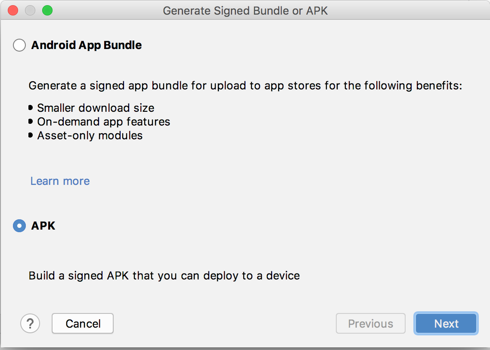
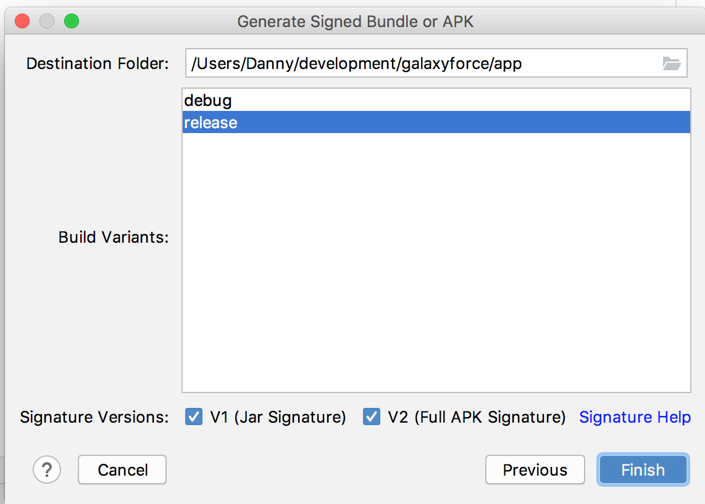
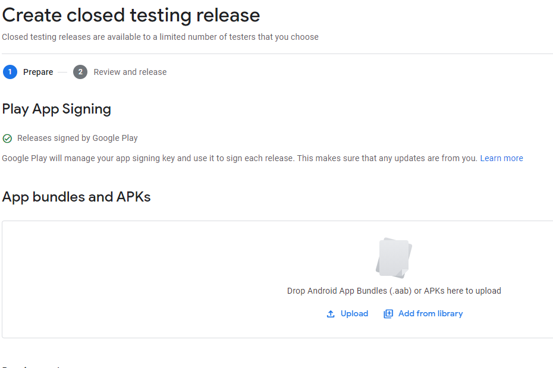

# Building, Testing and Deploying APKs

It is no longer recommended to upload Signed APKs to Google Play Console. This section explains how
to build signed APKs if needed.

### Building a Signed APK

From Android Studio, create a new signed APK.

```
Build -> Clean Project
```

```
Build -> Generate Signed Bundle / APK...
```



Choose APK then click `Next`.

Enter details key store details then click `Next`. It is important that the same keystore is used
every time as otherwise new APKs will be rejected by Google Play Console.



Choose `release` build variant and the two signature versions. Click `Finish`.

By default, your bundle will be located at: `...\galaxyforce\app\release\app-release.apk`. The
deobsfucation mapping file will be located
at: `...\galaxyforce\app\build\outputs\mapping\release\mapping.txt`.

***

### Testing a Signed APK

The signed APK can be tested on a real Android device by installing it onto a real device.

Find path to the Android SDK platform tools. Normally...

```
<path-to-android-sdk-tools>/android-sdk-macosx/platform-tools
```

Confirm Android device is connected:

```
./adb devices
```

Uninstall previous versions of the app:

```
./adb uninstall com.danosoftware.galaxyforce
```

Install the signed APK:

```
./adb install <path-to-galaxyforce-project>/app/release/app-release.apk
```

***

### Deploy to Google Play Console

Click on `Testing -> Closed Testing`. Choose to `Manage Track` for `Beta`.


Click on `Create new release`.



Here you can:

- Upload your signed APK (`.../app/release/app-release.apk`)
- Enter a release name
- Add release notes

Then press `Save`.

Click `Review release` to see the release changes. Once done, click `Start Rollout to Beta`.

***

### Upload Deobfuscation Files

To aid investigation of crash reports, the deobfuscation mapping files must be uploaded. These
mapping files change with every APK so must be re-uploaded with every new APK.

Click on `App bundle explorer`.


Click the `Downloads` tab.

Upload all the mapping files for the current APK (`.../app/build/outputs/mapping/release/`)

***